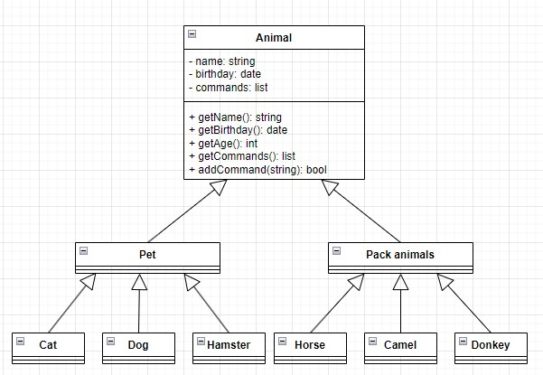

**Роман Роганов, группа 4717**

***Итоговая контрольная работа:***

**Операционные системы и виртуализация (Linux)**

1. Используя команду cat в терминале операционной системы Linux, создать два файла Домашние животные (заполнив файл собаками, кошками, хомяками) и Вьючные животными заполнив файл Лошадьми, верблюдами и ослы), а затем объединить их. Просмотреть содержимое созданного файла. Переименовать файл, дав ему новое имя (Друзья человека).
````bash
root@ubuntusrv:~/final_work$ cat > pets
собаки
кошки
хомяки
root@ubuntusrv:~/final_work$ cat > 'pack_animals'
лошади
верблюды
ослы
root@ubuntusrv:~/final_work$ cat pets pack_animals > animals
root@ubuntusrv:~/final_work$ cat animals
собаки
кошки
хомяки
лошади
верблюды
ослы
root@ubuntusrv:~/final_work$ mv animals 'Human Friends'
````
2. Создать директорию, переместить файл туда.
````bash
root@ubuntusrv:~/final_work$ mkdir animals
root@ubuntusrv:~/final_work$ mv 'Human Friends' animals
root@ubuntusrv:~/final_work$ cd animals/
root@ubuntusrv:~/final_work$ ll
итого 12
drwxrwxr-x 2 root root 4096 фев 14 18:30 ./
drwxrwxr-x 4 root root 4096 фев 14 18:30 ../
-rw-rw-r-- 1 root root   76 фев 14 18:29 Human Friends
````
3. Подключить дополнительный репозиторий MySQL. Установить любой пакет
из этого репозитория.
````bash
root@ubuntusrv:~/final_work/animals$ wget https://dev.mysql.com/get/mysql-apt-config_0.8.26-1_all.deb
root@ubuntusrv:~/final_work/animals$ sudo dpkg -i mysql-apt-config_0.8.26-1_all.deb
root@ubuntusrv:~/final_work/animals$ sudo apt install mysql-client mysql-community-server mysql-server
root@ubuntusrv:~/final_work/animals$ sudo apt update
root@ubuntusrv:~/final_work/animals$ sudo mysql_secure_installation
root@ubuntusrv:~/final_work/animals$ sudo mysql
````
4. Установить и удалить deb-пакет с помощью dpkg.
````bash
root@ubuntusrv:~$ apt download lftp
root@ubuntusrv:~$ sudo dpkg -i lftp_4.9.2-1build1_amd64.deb
root@ubuntusrv:~$ sudo dpkg -r lftp
````
5. Выложить историю команд в терминале ubuntu
````bash
  397  cat > pets
  398  cat > pack_animals
  399  cat pets pack_animals > animals
  400  cat animals 
  401  mv animals 'Human Friends'
  402  ll
  403  mkdir animals
  404  mv 'Human Friends' animals
  405  ll
  406  cd animals/
  407  ll
  408  sudo apt install mysql-server
  409  wget https://dev.mysql.com/get/mysql-apt-config_0.8.26-1_all.deb
  410  sudo dpkg -i mysql-apt-config_0.8.26-1_all.deb
  411  sudo apt update
  412  sudo apt install mysql-client mysql-community-server mysql-server
  413  sudo mysql_secure_installation
  414  sudo mysql
  415  history
  416  apt download lftp
  417  sudo dpkg -i lftp_4.9.2-1build1_amd64.deb
  418  sudo dpkg -r lftp
  419  history 
````

**Объектно-ориентированное программирование** 

6. Нарисовать диаграмму, в которой есть класс родительский класс, домашние животные и вьючные животные, в составы которых в случае домашних животных войдут классы: собаки, кошки, хомяки, а в класс вьючные животные войдут: Лошади, верблюды и ослы).




7. В подключенном MySQL репозитории создать базу данных “Друзья
человека”
8. Создать таблицы с иерархией из диаграммы в БД
9. Заполнить низкоуровневые таблицы именами(животных), командами
которые они выполняют и датами рождения
10. Удалив из таблицы верблюдов, т.к. верблюдов решили перевезти в другой
питомник на зимовку. Объединить таблицы лошади, и ослы в одну таблицу.
11.Создать новую таблицу “молодые животные” в которую попадут все
животные старше 1 года, но младше 3 лет и в отдельном столбце с точностью
до месяца подсчитать возраст животных в новой таблице
12. Объединить все таблицы в одну, при этом сохраняя поля, указывающие на
прошлую принадлежность к старым таблицам.
13.Создать класс с Инкапсуляцией методов и наследованием по диаграмме.
14. Написать программу, имитирующую работу реестра домашних животных.
В программе должен быть реализован следующий функционал:
14.1 Завести новое животное
14.2 определять животное в правильный класс
14.3 увидеть список команд, которое выполняет животное
14.4 обучить животное новым командам
14.5 Реализовать навигацию по меню
  
15.Создайте класс Счетчик, у которого есть метод add(), увеличивающий̆ значение внутренней̆ int переменной̆ на 1 при нажатие “Завести новое животное” Сделайте так, чтобы с объектом такого типа можно было работать в блоке try-with-resources. Нужно бросить исключение, если работа с объектом типа счетчик была не в ресурсном try и/или ресурс остался открыт. Значение считать в ресурсе try, если при заведения животного заполнены все поля.

